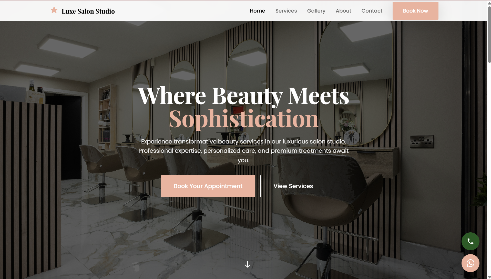

# Luxe Salon Website

A modern HTML project utilizing Tailwind CSS for building responsive web applications with minimal setup.

[](assets/hero.png)

---

## 🔗 Live Demo

[https://aryan-sengar-portfolio-v2.netlify.app/](https://aryan-sengar-portfolio-v2.netlify.app/)

---

## 🚀 Features

- **HTML5** - Modern HTML structure with best practices
- **Tailwind CSS** - Utility-first CSS framework for rapid UI development
- **Custom Components** - Pre-built component classes for buttons and containers
- **NPM Scripts** - Easy-to-use commands for development and building
- **Responsive Design** - Mobile-first approach for all screen sizes

---

## 📁 Project Structure

├── index.html

├── pages/

│ ├── homepage.html

│ ├── about_us.html

│ ├── services.html

│ ├── gallery.html

│ ├── book_appointment.html

│ └── contact.html

├── css/

│ ├── tailwind.css

│ └── main.css

├── public/

│ ├── favicon.ico

│ └── manifest.json

├── tailwind.config.js

├── package.json

└── README.md

---

## 📋 Prerequisites

- Node.js (v12.x or higher)
- npm or yarn

---

## 🛠️ Installation

1. Install dependencies:

```bash
npm install
# or
yarn install
```

2. Start the development server:

```bash
npm run dev
# or
yarn dev
```

---

## 📁 Project Structure

```
html_app/
├── css/
│   ├── tailwind.css   # Tailwind source file with custom utilities
│   └── main.css       # Compiled CSS (generated)
├── pages/             # HTML pages
├── index.html         # Main entry point
├── package.json       # Project dependencies and scripts
└── tailwind.config.js # Tailwind CSS configuration
```

---

## 🎨 Styling

This project uses Tailwind CSS for styling. Custom utility classes include:

---

## 🧩 Customization

To customize the Tailwind configuration, edit the `tailwind.config.js` file:

---

## 📦 Build for Production

Build the CSS for production:

```bash
npm run build:css
# or
yarn build:css
```

---

## 📱 Responsive Design

The app is built with responsive design using Tailwind CSS breakpoints:

- `sm`: 640px and up
- `md`: 768px and up
- `lg`: 1024px and up
- `xl`: 1280px and up
- `2xl`: 1536px and up

---

## 👨‍💻 Author

Aryan Sengar
Frontend Developer | UI Enthusiast

---

## 🙌 Acknowledgements

I would like to acknowledge the open-source community and the creators of Tailwind CSS for providing powerful tools that helped streamline the design and development process. Inspiration for UI/UX patterns was drawn from modern salon and luxury brand websites. This project was developed independently as a learning and portfolio initiative.

---

© 2025 Aryan Sengar – All Rights Reserved  
Unauthorized copying is strictly prohibited.

---

> 💬 _Feel free to drop a ⭐ if you find this helpful!_
