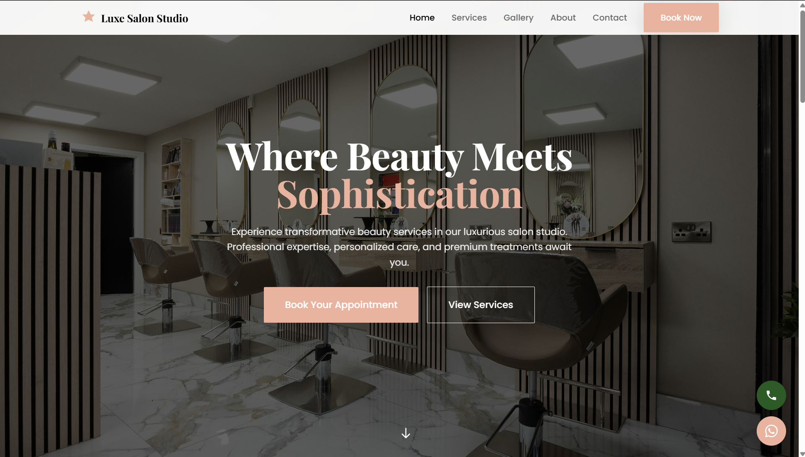

<div align="center">

<!-- ╔══════════════════════════════════════════════════════════════╗ -->
<!--                   ANIMATED WAVE HEADER                         -->
<!-- ╚══════════════════════════════════════════════════════════════╝ -->


<!-- ╔══════════════════════════════════════════════════════════════╗ -->
<!--                  ANIMATED TYPING TAGLINE                       -->
<!-- ╚══════════════════════════════════════════════════════════════╝ -->


<br/>

<!-- ╔══════════════════════════════════════════════════════════════╗ -->
<!--                      CTA BUTTONS                               -->
<!-- ╚══════════════════════════════════════════════════════════════╝ -->

[](https://luxe-salon-website.netlify.app/)
[](https://github.com/aryansengar007/luxe-salon-website)

<br/>

<!-- ╔══════════════════════════════════════════════════════════════╗ -->
<!--               ANIMATED SKILL / TECH ICON BADGES                -->
<!-- ╚══════════════════════════════════════════════════════════════╝ -->


<br/><br/>


</div>

<br/>

<!-- ━━━━━━━━━━━━━━━━━━━━━━━━━━━━ WAVE DIVIDER ━━━━━━━━━━━━━━━━━━━━━━━━━━━━ -->


<br/>

<!-- ╔══════════════════════════════════════════════════════════════╗ -->
<!--                      SITE PREVIEW                              -->
<!-- ╚══════════════════════════════════════════════════════════════╝ -->

<div align="center">

[](https://luxe-salon-website.netlify.app/)

*Click the preview to visit the live site ↑*

</div>

<br/>

<!-- ━━━━━━━━━━━━━━━━━━━━━━━━━━━━ WAVE DIVIDER ━━━━━━━━━━━━━━━━━━━━━━━━━━━━ -->


<br/>

## 💅 About The Project

A **modern, multi-page luxury salon website** built with **HTML5** and **Tailwind CSS** — delivering a premium, mobile-first user experience across 6 fully responsive pages. Powered by npm scripts for fast development and a clean production build workflow.

> 🌸 Developed as a portfolio and learning initiative — blending elegant UI design with a scalable Tailwind CSS architecture.

<br/>

<div align="center">

| 🎨 Styling | 📄 Pages | 📱 Responsive | 🚀 Build |
|:---:|:---:|:---:|:---:|
| Tailwind CSS utility-first | 6 fully built HTML pages | Mobile-first breakpoints | npm scripts + production CSS |

</div>

<br/>

<!-- ━━━━━━━━━━━━━━━━━━━━━━━━━━━━ WAVE DIVIDER ━━━━━━━━━━━━━━━━━━━━━━━━━━━━ -->


<br/>

## ✨ Features

<br/>

| 🎨 UI & Design | ⚙️ Development | 📱 Responsiveness |
|:---|:---|:---|
| Modern HTML5 structure with best practices | npm scripts for dev & production build | Mobile-first approach for all screen sizes |
| Tailwind CSS utility-first styling | `tailwind.config.js` for full customization | Tailwind breakpoints: sm · md · lg · xl · 2xl |
| Custom component classes — buttons & containers | `npm run dev` hot-reload development | Consistent layout across all 6 pages |
| Premium luxury UI/UX aesthetic | `npm run build:css` production-ready output | — |

<br/>

### 📌 Pages Included

```
Home  ·  About Us  ·  Services  ·  Gallery  ·  Book Appointment  ·  Contact
```

<br/>

<!-- ━━━━━━━━━━━━━━━━━━━━━━━━━━━━ WAVE DIVIDER ━━━━━━━━━━━━━━━━━━━━━━━━━━━━ -->


<br/>

## 🛠️ Tech Stack

<br/>

<div align="center">


<br/><br/>

| Layer | Technology | Purpose |
|:---:|:---|:---|
| 🏗️ **Structure** | HTML5 | Semantic, accessible multi-page markup |
| 🎨 **Styling** | Tailwind CSS | Utility-first, responsive design system |
| ⚙️ **Build Tool** | npm Scripts | Dev server, CSS compilation & production build |
| 🔧 **Config** | tailwind.config.js | Custom theme, colors & breakpoint extensions |
| 🚀 **Deployment** | Netlify | Live hosting & continuous deployment |

</div>

<br/>

<!-- ━━━━━━━━━━━━━━━━━━━━━━━━━━━━ WAVE DIVIDER ━━━━━━━━━━━━━━━━━━━━━━━━━━━━ -->


<br/>

## 📱 Responsive Breakpoints

<div align="center">

| Breakpoint | Screen Width | Target Devices |
|:---:|:---:|:---|
| `sm` | 640px and up | Large phones, small tablets |
| `md` | 768px and up | Tablets, portrait iPads |
| `lg` | 1024px and up | Laptops, landscape tablets |
| `xl` | 1280px and up | Desktops, large laptops |
| `2xl` | 1536px and up | Wide monitors, ultrawide screens |

</div>

<br/>

<!-- ━━━━━━━━━━━━━━━━━━━━━━━━━━━━ WAVE DIVIDER ━━━━━━━━━━━━━━━━━━━━━━━━━━━━ -->


<br/>

## 📁 Project Structure

```
luxe-salon-website/
│
├── 📄 index.html                    ← Main entry point
│
├── 📂 pages/
│   ├── homepage.html                ← Homepage / hero section
│   ├── about_us.html                ← About the salon
│   ├── services.html                ← Services offered
│   ├── gallery.html                 ← Photo gallery
│   ├── book_appointment.html        ← Appointment booking form
│   └── contact.html                 ← Contact details & map
│
├── 📂 css/
│   ├── tailwind.css                 ← Tailwind source with custom utilities
│   └── main.css                     ← Compiled CSS output (generated)
│
├── 📂 public/
│   ├── favicon.ico                  ← Site favicon
│   └── manifest.json                ← Web app manifest
│
├── 📄 tailwind.config.js            ← Tailwind theme & customization
├── 📄 package.json                  ← Project scripts & dependencies
└── 📄 README.md
```

<br/>

<!-- ━━━━━━━━━━━━━━━━━━━━━━━━━━━━ WAVE DIVIDER ━━━━━━━━━━━━━━━━━━━━━━━━━━━━ -->


<br/>

## 📋 Prerequisites

| Requirement | Version |
|:---:|:---:|
| 🟢 Node.js | v12.x or higher |
| 📦 npm or yarn | Latest stable |

<br/>

<!-- ━━━━━━━━━━━━━━━━━━━━━━━━━━━━ WAVE DIVIDER ━━━━━━━━━━━━━━━━━━━━━━━━━━━━ -->


<br/>

## 🚀 Getting Started

**1. Clone the repository**

```bash
git clone https://github.com/aryansengar007/luxe-salon-website.git
cd luxe-salon-website
```

**2. Install dependencies**

```bash
npm install
# or
yarn install
```

**3. Start the development server**

```bash
npm run dev
# or
yarn dev
```

> ✅ Tailwind CSS will compile automatically on file changes.

<br/>

<!-- ━━━━━━━━━━━━━━━━━━━━━━━━━━━━ WAVE DIVIDER ━━━━━━━━━━━━━━━━━━━━━━━━━━━━ -->


<br/>

## 📦 Build for Production

Compile and minify Tailwind CSS for deployment:

```bash
npm run build:css
# or
yarn build:css
```

> ✅ Outputs an optimised `main.css` with only the used Tailwind classes — significantly smaller file size.

<br/>

<!-- ━━━━━━━━━━━━━━━━━━━━━━━━━━━━ WAVE DIVIDER ━━━━━━━━━━━━━━━━━━━━━━━━━━━━ -->


<br/>

## 🧩 Customization

To customize colors, fonts, spacing, or extend the design system, edit `tailwind.config.js`:

```js
// tailwind.config.js
module.exports = {
  content: ["./**/*.html"],
  theme: {
    extend: {
      // Add your custom colors, fonts, or spacing here
    },
  },
  plugins: [],
};
```

<br/>

<!-- ━━━━━━━━━━━━━━━━━━━━━━━━━━━━ WAVE DIVIDER ━━━━━━━━━━━━━━━━━━━━━━━━━━━━ -->


<br/>

## 🙌 Acknowledgements

- 💡 UI/UX inspiration from modern salon and luxury brand websites
- 🎨 Styling powered by [Tailwind CSS](https://tailwindcss.com/)
- 🚀 Deployed via [Netlify](https://www.netlify.com/)
- 🌐 Open-source community for tooling & resources

<br/>

## 👨‍💻 Author

<div align="center">

### Aryan Sengar

🎓 **B.Tech CSE (AI & ML)** @ The NorthCap University &nbsp;|&nbsp; 🌍 Gurgaon, India
&nbsp;|&nbsp; Frontend Developer & UI Enthusiast

<br/>

[](https://www.linkedin.com/in/aryan-sengar-786b96290/)
[](https://github.com/aryansengar007)

</div>

<br/>

<!-- ╔══════════════════════════════════════════════════════════════╗ -->
<!--                   ANIMATED WAVE FOOTER                         -->
<!-- ╚══════════════════════════════════════════════════════════════╝ -->


<div align="center">

© 2025 **Aryan Sengar** — All Rights Reserved. Unauthorized copying is strictly prohibited.

<br/>

*If you found this project helpful or inspiring, consider leaving a* ⭐ *— it means a lot!*

</div>
